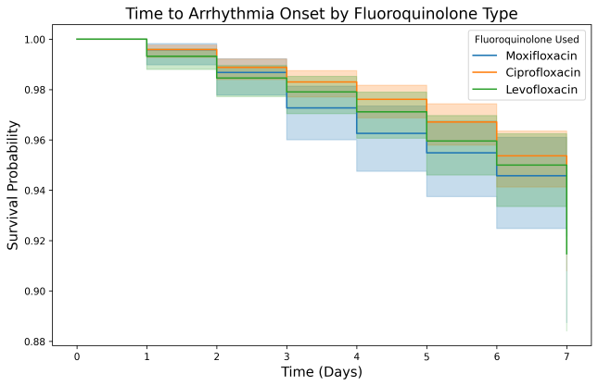
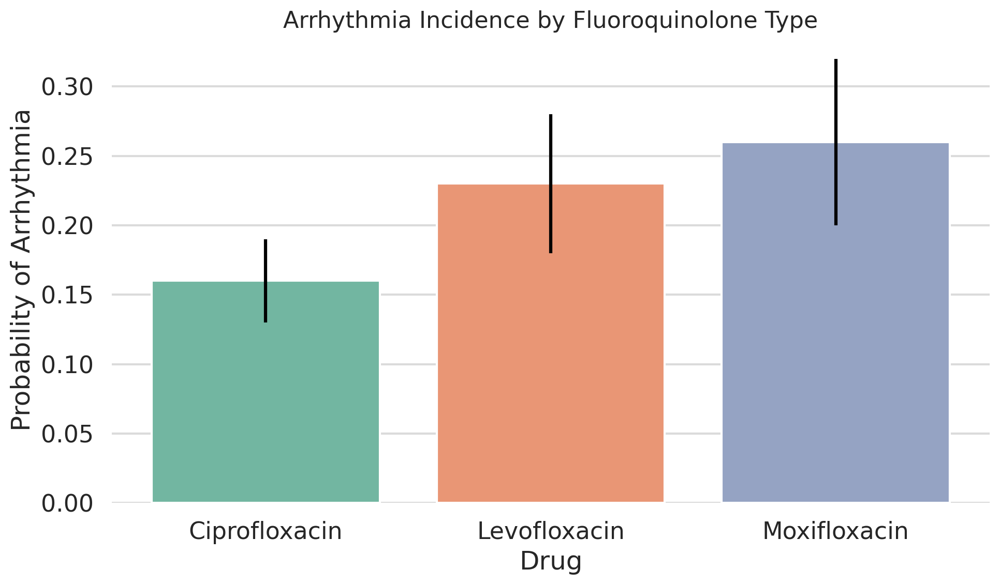
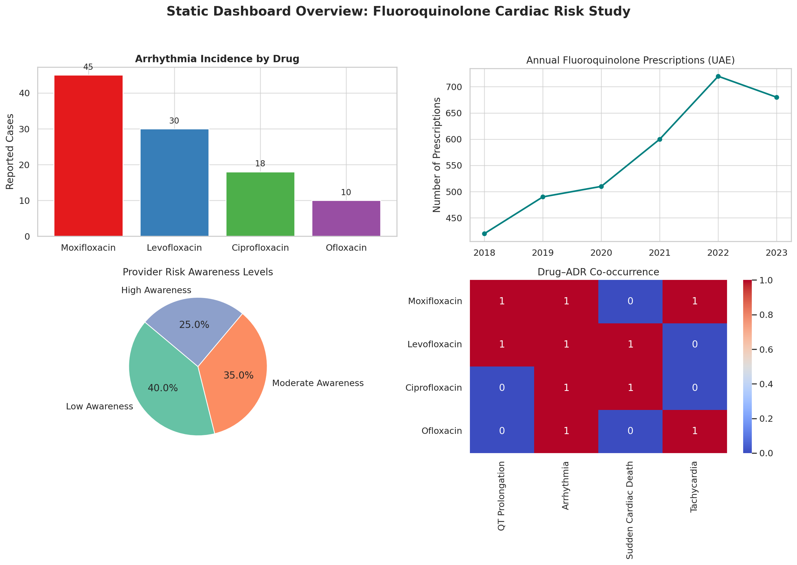

# 🧬 Fluoroquinolone-Associated Cardiotoxicity in the UAE: NLP-Based Real-World Risk Analysis (2018–2025)

[](https://doi.org/10.5281/zenodo.15271591)

## 🧠 Introduction

This repository contains a reproducible analysis pipeline that investigates the cardiovascular risks associated with fluoroquinolone antibiotics in the UAE using a multi-modal AI framework. By combining natural language processing (NLP), pharmacovigilance reports, physician notes, and machine learning (ML), the study aims to:

- Assess adverse cardiac outcomes (QT prolongation, arrhythmias, sudden cardiac death)
- Analyze prescribing trends (2018–2025) using real-world and simulated UAE data
- Measure risk awareness among healthcare providers
- Predict high-risk cases using AI-based models

This work helps bridge the regional data gap and supports policy recommendations for safer prescribing practices.

---

## 📊 Results / Figures

### 1. Kaplan–Meier Survival Analysis

This figure illustrates the time-to-onset of arrhythmia events stratified by fluoroquinolone type. Moxifloxacin demonstrates a steeper early drop, indicating faster onset in some patients.



---

### 2. Logistic Regression (Odds Ratios)

Forest plot displaying adjusted odds ratios (OR) for arrhythmia risk by drug type and predisposing conditions. Moxifloxacin shows significantly increased adjusted risk.


---

### 3. Arrhythmia Incidence by Fluoroquinolone Type

This bar chart compares the predicted probabilities of arrhythmia for each fluoroquinolone. Moxifloxacin ranked highest, followed by levofloxacin and ciprofloxacin.



---

## 📂 Project Structure

```plaintext
📁 data/
    ├── prescriptions_mohap_2018_2023.csv
    ├── faers_cardio_adrs_cleaned.csv
    ├── ehr_physician_notes_sample.csv
    ├── co_medication_interactions.csv
    └── literature_guidelines_extracted.csv

📁 models/
    ├── fq_cardiac_risk_classifier.pkl
    └── transformers_fine_tuned_ner_model/ (includes config.json, tokenizer.json, model.safetensors, etc.)

📁 results/
    ├── descriptive_statistics_summary.csv
    ├── risk_awareness_scores_by_provider.csv
    ├── time_trend_prescribing_2020_2025.csv
    └── model_performance_metrics.json

📁 figures/
    ├── km_arrhythmia_by_drug.png
    ├── logistic_odds_ratios_arrhythmia.png
    └── arrhythmia_probability_by_drug.png

📁 notebooks/
    ├── 01_data_cleaning_preprocessing.ipynb
    ├── 02_ner_and_sentiment_analysis.ipynb
    ├── 03_risk_prediction_model_training.ipynb
    ├── 04_kaplan_meier_and_logistic_regression.ipynb
    └── 05_dashboard_visualization_powerbi.ipynb

## 📊 Interactive Dashboard

This interactive Power BI dashboard provides a real-time summary of fluoroquinolone prescribing patterns, risk signals, and ADRs across the UAE (2018–2023). It includes:
- Drug-specific arrhythmia risks
- High-risk co-prescription alerts
- Timeline-based prescribing trends

🔗 [Open Dashboard in Power BI](https://yourpowerbi-public-url.com)

### 📷 Static Preview




